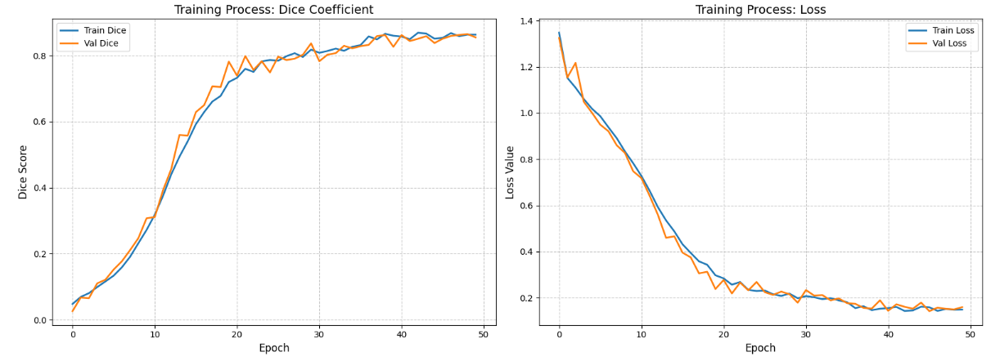
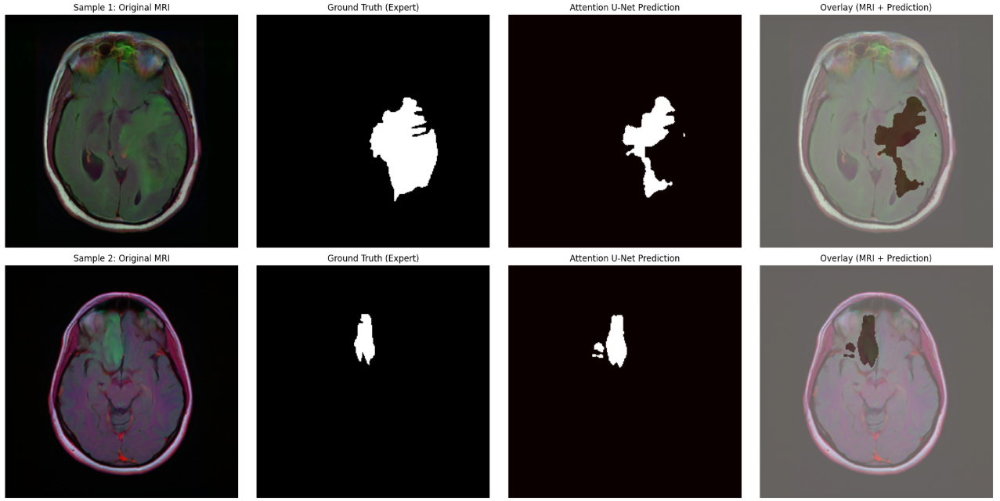

# 🧠 Brain Tumor Segmentation with Attention U-Net

This repository contains a deep learning pipeline for the automated segmentation of brain tumors from MRI scans. By utilizing an **Attention U-Net** architecture, the model effectively suppresses irrelevant background areas while focusing on tumor-specific features.

## 🚀 Performance Overview

The model was trained for 50 epochs and achieved high-accuracy results, demonstrating robust generalization on medical imaging data.

| Metric | Training Value | Validation Value |
| :--- | :--- | :--- |
| **Dice Coefficient** | **0.8670** | **0.8549** |
| **Loss (BCE + Dice)** | 0.1447 | 0.1590 |

---

## 📈 Training Process

The following plots illustrate the model's learning journey. The stable increase in the Dice score and the smooth decrease in loss indicate a healthy training process without significant overfitting.

<p align="center">
  
</p>


---

## 🏗️ Model Architecture: Attention U-Net

Unlike standard U-Net, this architecture incorporates **Attention Gates**. These gates filter the features passed through skip connections, allowing the decoder to focus only on relevant spatial regions.


**Key Components:**
* **Encoder Path:** Extracts high-level features.
* **Attention Gates:** Highlights tumor regions in skip connections.
* **Decoder Path:** Reconstructs the segmentation mask with refined spatial information.
* **Hybrid Loss:** A combination of Binary Cross-Entropy (BCE) and Dice Loss.

---

## 🖼️ Segmentation Results

Below are sample predictions from the test set. The model shows high precision in identifying tumor boundaries, even in complex MRI structures.

<p align="center">
  
</p>

* **Original MRI:** Raw input scan.
* **Ground Truth:** Expert-labeled tumor area.
* **Prediction:** Output generated by the Attention U-Net.
* **Overlay:** Visualization of the prediction aligned with the original MRI.

---

## 🛠️ Tech Stack & Requirements

* **Framework:** TensorFlow / Keras
* **Image Processing:** OpenCV, Albumentations (Data Augmentation)
* **Visualization:** Matplotlib, NumPy
* **Environment:** Kaggle / Google Colab (GPU Accelerated)

---

## 💻 How to Run

1. **Clone the repository:**
   ```bash
   git clone [https://github.com/yourusername/Brain-Tumor-Segmentation-Attention-UNet.git](https://github.com/yourusername/Brain-Tumor-Segmentation-Attention-UNet.git)
